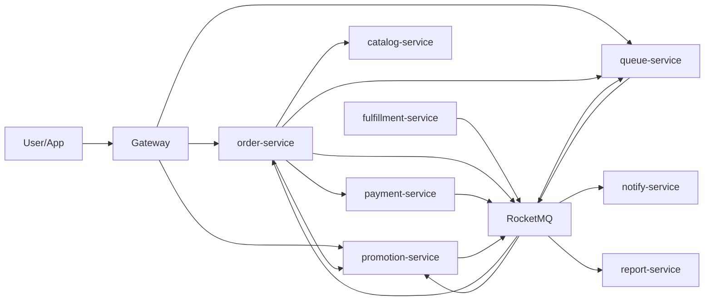

# MealFlow API 与事件契约设计

## 1. 本文定位

本文面向开发，定义核心服务的接口、事件和幂等键。实现时应优先保证这些契约稳定，再考虑内部代码结构。

约定：

- 外部接口走 Gateway。
- 内部接口只允许服务间调用，不能暴露给前端。
- 所有写接口必须支持 `requestId` 或业务幂等键。
- 所有事件必须带 `eventId`、`eventKey`、`traceId`、`occurredAt`。
- `eventKey` 必须全局唯一，格式建议为 `{producerService}:{eventType}:{businessKey}:{version}`，不能只在单个服务内唯一。

统一事件信封：

```json
{
  "eventId": 10001,
  "eventKey": "order:OrderCreated:20001:1",
  "eventType": "OrderCreatedEvent",
  "eventVersion": 1,
  "aggregateType": "ORDER",
  "aggregateId": 20001,
  "traceId": "abc",
  "occurredAt": "2026-06-27T12:00:00",
  "payload": {}
}
```

## 2. order-service

### 2.1 提交订单

```text
POST /orders/submit
```

请求：

```json
{
  "requestId": "submit-20260627-001",
  "merchantId": 10,
  "addressId": 20,
  "cartItemIds": [1, 2],
  "userVoucherId": 300,
  "remark": "少辣"
}
```

返回有产能：

```json
{
  "mode": "ORDER_CREATED",
  "orderId": 20001,
  "payOrderId": 90001,
  "status": "PENDING_PAYMENT"
}
```

返回排队：

```json
{
  "mode": "QUEUED",
  "ticketId": 80001,
  "ticketNo": "QT202606270001",
  "aheadCount": 25,
  "estimatedWaitSeconds": 900,
  "expireTime": "2026-06-27T12:15:00"
}
```

处理规则：

```text
校验 requestId
-> 构造订单快照
-> 调 catalog-service 预占库存
-> 调 promotion-service 锁定优惠券
-> 调 queue-service 申请处理资格
-> READY 则创建订单
-> QUEUED 则返回 ticket
```

失败回滚：

- 库存预占成功、优惠券锁定失败：释放库存。
- 优惠券锁定成功、排队失败：释放库存和优惠券。
- 创建订单失败：释放 capacity_token、库存、优惠券。

### 2.2 根据 QueueTicket 创建订单

```text
POST /internal/orders/from-ticket
```

请求：

```json
{
  "requestId": "from-ticket-80001",
  "ticketId": 80001,
  "ticketNo": "QT202606270001",
  "capacityTokenId": 70001,
  "merchantId": 10,
  "userId": 100,
  "cartSnapshot": {},
  "priceSnapshot": {},
  "submitSnapshot": {}
}
```

规则：

```text
requestId 默认使用 from-ticket:{ticketId}
先按 queue_ticket_id 查询订单
有则返回已有 orderId
没有则创建订单
写 OrderCreatedFromTicketEvent
```

事件：

```text
OrderCreatedFromTicketEvent
eventKey = order:OrderCreatedFromTicket:{ticketId}:1
```

### 2.3 取消订单

```text
POST /orders/{orderId}/cancel
```

请求：

```json
{
  "requestId": "cancel-001",
  "reason": "用户主动取消"
}
```

规则：

- `PENDING_PAYMENT` 可取消。
- `WAIT_MERCHANT_ACCEPT` 可取消。
- `MERCHANT_ACCEPTED` 后是否可取消由商户规则决定。
- 取消成功后释放 `capacity_token`、`stock_reservation`、`voucher_lock`，关闭支付单。

## 3. queue-service

### 3.1 申请处理资格

```text
POST /internal/queue/capacity/apply
```

请求：

```json
{
  "requestId": "queue-apply-submit-20260627-001",
  "userId": 100,
  "merchantId": 10,
  "cartSnapshot": {},
  "priceSnapshot": {},
  "submitSnapshot": {},
  "expireTime": "2026-06-27T12:15:00"
}
```

返回 READY：

```json
{
  "result": "READY",
  "capacityTokenId": 70001
}
```

返回 QUEUED：

```json
{
  "result": "QUEUED",
  "ticketId": 80001,
  "ticketNo": "QT202606270001",
  "aheadCount": 25,
  "estimatedWaitSeconds": 900
}
```

规则：

- queue-service 使用 `requestId` 对 `capacity_token` 创建做幂等保护，重复申请同一 `requestId` 必须返回同一个 `capacityTokenId` 或 `ticketId`。
- 有产能时创建 `capacity_token HELD`。
- 无产能时创建 `queue_ticket WAITING`。
- Redis 写失败不影响 MySQL 事实，但必须记录补偿任务。

### 3.2 查询 ticket

```text
GET /queue/tickets/{ticketId}
```

返回：

```json
{
  "ticketId": 80001,
  "ticketNo": "QT202606270001",
  "status": "WAITING",
  "aheadCount": 25,
  "estimatedWaitSeconds": 900,
  "expireTime": "2026-06-27T12:15:00",
  "canCancel": true
}
```

### 3.3 取消 ticket

```text
POST /queue/tickets/{ticketId}/cancel
```

请求：

```json
{
  "requestId": "queue-cancel-80001-001",
  "reason": "用户取消排队"
}
```

规则：

- 同一 `requestId` 重试必须返回同一取消结果。
- WAITING：取消排队，移除 ZSet。
- READY：取消处理资格，释放 capacity_token。
- PROCESSING：先查订单是否已创建，未创建则取消，已创建转订单取消。

### 3.4 订单创建回告

```text
POST /internal/queue/tickets/{ticketId}/order-created
```

请求：

```json
{
  "requestId": "queue-order-created-80001-20001",
  "orderId": 20001
}
```

规则：

```text
requestId 默认使用 queue-order-created:{ticketId}:{orderId}
READY/PROCESSING -> ORDER_CREATED
写 order_id
回填 capacity_token.order_id
```

幂等键：

- 接口重试幂等键：`requestId`。
- 业务幂等键：URL 中的 `ticketId`。
- 同一 ticket 重复回告时，如果已经是 `ORDER_CREATED` 且 `order_id` 相同，直接返回成功。

也可以由 queue-service 消费 `OrderCreatedFromTicketEvent` 完成。

## 4. promotion-service

### 4.1 秒杀领券

```text
POST /vouchers/{voucherId}/seckill
```

请求：

```json
{
  "requestId": "claim-001"
}
```

返回：

```json
{
  "claimId": 50001,
  "status": "PROCESSING"
}
```

失败：

```json
{
  "status": "SOLD_OUT",
  "message": "已抢完"
}
```

规则：

```text
Lua 校验库存和一人一券
-> 成功后写 voucher_claim ACCEPTED
-> 写 local_event VoucherClaimAccepted
-> 异步创建 user_voucher
```

### 4.2 锁定优惠券

```text
POST /internal/vouchers/lock
```

请求：

```json
{
  "requestId": "voucher-lock-submit-20260627-001",
  "userId": 100,
  "userVoucherId": 300,
  "ticketId": 80001,
  "orderId": null,
  "lockExpireTime": "2026-06-27T12:15:00"
}
```

返回：

```json
{
  "voucherLockId": 60001,
  "status": "LOCKED",
  "discountAmount": 500
}
```

### 4.3 确认/释放优惠券

```text
POST /internal/vouchers/confirm
POST /internal/vouchers/release
```

确认请求：

```json
{
  "requestId": "voucher-confirm-pay-90001",
  "voucherLockId": 60001,
  "orderId": 20001
}
```

释放请求：

```json
{
  "requestId": "voucher-release-cancel-20001",
  "voucherLockId": 60001,
  "orderId": 20001,
  "reason": "ORDER_CANCELLED"
}
```

规则：

- Confirm/Release 都必须携带 `requestId`。
- `voucherLockId` 是业务定位键，`requestId` 是接口重试幂等键。
- `requestId` 按操作派生，例如 `voucher-confirm:{orderId}:{voucherLockId}` 或 `voucher-release:{orderId}:{voucherLockId}:{reason}`。
- 重试同一 `requestId` 时必须返回同一个 `voucherLockId`。
- Confirm：`voucher_lock LOCKED -> CONFIRMED`，`user_voucher LOCKED -> USED`。
- Release：`voucher_lock LOCKED -> RELEASED`，`user_voucher LOCKED -> AVAILABLE`。
- 必须 CAS，重复释放不能重复恢复。

## 5. catalog-service

### 5.1 预占库存

```text
POST /internal/stocks/reserve
```

请求：

```json
{
  "requestId": "stock-reserve-submit-20260627-001",
  "userId": 100,
  "merchantId": 10,
  "ticketId": 80001,
  "orderId": null,
  "items": [
    {
      "skuId": 1,
      "quantity": 2
    }
  ],
  "expireTime": "2026-06-27T12:15:00"
}
```

返回：

```json
{
  "reservationIds": [40001, 40002],
  "status": "RESERVED"
}
```

### 5.2 确认/释放库存

```text
POST /internal/stocks/confirm
POST /internal/stocks/release
```

确认请求：

```json
{
  "requestId": "stock-confirm-pay-90001",
  "reservationIds": [40001, 40002],
  "orderId": 20001
}
```

释放请求：

```json
{
  "requestId": "stock-release-cancel-20001",
  "reservationIds": [40001, 40002],
  "orderId": 20001,
  "reason": "ORDER_CANCELLED"
}
```

规则：

- Confirm/Release 都必须携带 `requestId`。
- `reservationIds` 是业务定位键，`requestId` 是接口重试幂等键。
- `requestId` 按操作派生，例如 `stock-confirm:{orderId}` 或 `stock-release:{orderId}:{reason}`。
- 重试同一 `requestId` 时必须返回同一批 `reservationIds`。
- Confirm：支付成功后 `RESERVED -> CONFIRMED`。
- Release：取消、超时、失败后 `RESERVED -> RELEASED` 并回补可售库存。

## 6. fulfillment-service

### 6.1 商户接单

```text
POST /fulfillment/orders/{orderId}/accept
```

请求：

```json
{
  "requestId": "fulfillment-accept-20001-001"
}
```

事件：

```text
MerchantAcceptedEvent
eventKey = fulfillment:MerchantAccepted:{fulfillmentOrderId}:{version}
```

注意：接单不释放厨房产能。

### 6.2 商户拒单

```text
POST /fulfillment/orders/{orderId}/reject
```

请求：

```json
{
  "requestId": "fulfillment-reject-20001-001",
  "reason": "商品售罄"
}
```

事件：

```text
MerchantRejectedEvent
MerchantCapacityReleaseRequestedEvent
```

拒单释放产能。

### 6.3 出餐完成

```text
POST /fulfillment/orders/{orderId}/meal-ready
```

请求：

```json
{
  "requestId": "fulfillment-meal-ready-20001-001"
}
```

事件：

```text
MealReadyEvent
MerchantCapacityReleaseRequestedEvent
```

出餐完成释放厨房产能。

### 6.4 骑手分配

```text
POST /fulfillment/orders/{orderId}/assign-rider
```

请求：

```json
{
  "requestId": "fulfillment-assign-rider-20001-001",
  "riderId": 30001
}
```

事件：

```text
DeliveryAssignedEvent
eventKey = fulfillment:DeliveryAssigned:{deliveryOrderId}:{version}
```

骑手分配不释放厨房产能，只推动配送单从 `WAIT_ASSIGN` 到 `ASSIGNED`，并通知骑手端。

### 6.5 骑手取餐

```text
POST /fulfillment/orders/{orderId}/picked-up
```

请求：

```json
{
  "requestId": "fulfillment-picked-up-20001-001"
}
```

事件：

```text
DeliveryPickedUpEvent
eventKey = fulfillment:DeliveryPickedUp:{deliveryOrderId}:{version}
```

### 6.6 骑手送达

```text
POST /fulfillment/orders/{orderId}/delivered
```

请求：

```json
{
  "requestId": "fulfillment-delivered-20001-001"
}
```

事件：

```text
DeliveryCompletedEvent
eventKey = fulfillment:DeliveryCompleted:{deliveryOrderId}:{version}
```

履约写接口统一规则：

- 每个写接口必须携带 `requestId`。
- 同一 `requestId` 重试必须返回同一业务结果。
- 状态机和 `requestId` 幂等是两层保护，不能互相替代。

## 7. 事件清单

| 事件 | 生产服务 | 消费服务 | event_key |
| --- | --- | --- | --- |
| QueueTicketReadyEvent | queue | order、notify | queue:QueueTicketReady:{ticketId}:{version} |
| QueueTicketCancelledEvent | queue | order、catalog、promotion、notify | queue:QueueTicketCancelled:{ticketId}:{version} |
| MerchantCapacityReleaseRequestedEvent | order | queue | order:MerchantCapacityReleaseRequested:{capacityTokenId}:{reason}:{eventVersion} |
| MerchantCapacityReleaseRequestedEvent | fulfillment | queue | fulfillment:MerchantCapacityReleaseRequested:{capacityTokenId}:{reason}:{eventVersion} |
| OrderCreatedFromTicketEvent | order | queue、notify | order:OrderCreatedFromTicket:{ticketId}:1 |
| OrderCreatedEvent | order | payment、notify、report | order:OrderCreated:{orderId}:1 |
| OrderCancelledEvent | order | payment、catalog、promotion、queue、notify | order:OrderCancelled:{orderId}:{version} |
| PaymentSuccessEvent | payment | order、promotion、catalog、notify | payment:PaymentSuccess:{paymentOrderId}:1 |
| PaymentTimeoutEvent | payment | order、catalog、promotion、queue | payment:PaymentTimeout:{paymentOrderId}:1 |
| RefundRequestedEvent | order | payment、notify | order:RefundRequested:{orderId}:{version} |
| RefundStartedEvent | payment | order、notify | payment:RefundStarted:{refundOrderId}:1 |
| RefundSuccessEvent | payment | order、notify、report | payment:RefundSuccess:{refundOrderId}:1 |
| RefundFailedEvent | payment | order、notify、ops | payment:RefundFailed:{refundOrderId}:1 |
| AfterSaleRequestedEvent | order | notify、ops | order:AfterSaleRequested:{orderId}:{version} |
| AfterSaleApprovedEvent | order | payment、notify | order:AfterSaleApproved:{orderId}:{version} |
| AfterSaleRejectedEvent | order | notify | order:AfterSaleRejected:{orderId}:{version} |
| MerchantAcceptedEvent | fulfillment | order、notify | fulfillment:MerchantAccepted:{fulfillmentOrderId}:{version} |
| MerchantRejectedEvent | fulfillment | order、queue、notify | fulfillment:MerchantRejected:{fulfillmentOrderId}:{version} |
| MealReadyEvent | fulfillment | order、queue、delivery、notify | fulfillment:MealReady:{fulfillmentOrderId}:{version} |
| DeliveryAssignedEvent | fulfillment | notify、rider-app | fulfillment:DeliveryAssigned:{deliveryOrderId}:{version} |
| DeliveryPickedUpEvent | fulfillment | order、notify | fulfillment:DeliveryPickedUp:{deliveryOrderId}:{version} |
| DeliveryCompletedEvent | fulfillment | order、notify、report | fulfillment:DeliveryCompleted:{deliveryOrderId}:{version} |
| VoucherClaimAcceptedEvent | promotion | promotion-worker、notify | promotion:VoucherClaimAccepted:{voucherId}:{userId}:1 |

`MerchantCapacityReleaseRequestedEvent` 的 `{eventVersion}` 来自 `local_event.event_version`，表示事件 schema 版本，当前填 `1`。它不来自 `capacity_token`，因为 `capacity_token` 表没有 version 字段。

## 8. 服务调用图



## 9. 开发顺序建议

1. 先做表结构和枚举。
2. 再做 requestId 幂等组件。
3. 再做 Outbox 和 consumer_record。
4. 再做 QueueTicket + capacity_token。
5. 再做订单状态机。
6. 再接库存预占和优惠券锁定。
7. 最后做秒杀券和压测。

这个顺序能减少返工，因为后面的模块都依赖幂等、事件和状态机基础设施。
