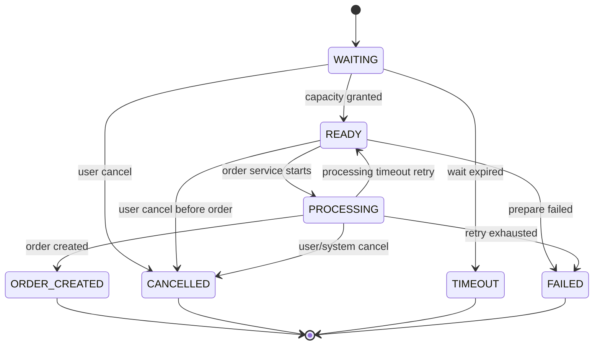
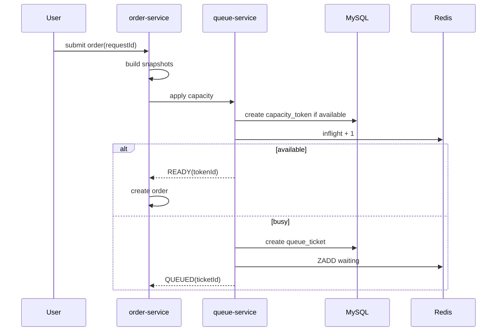
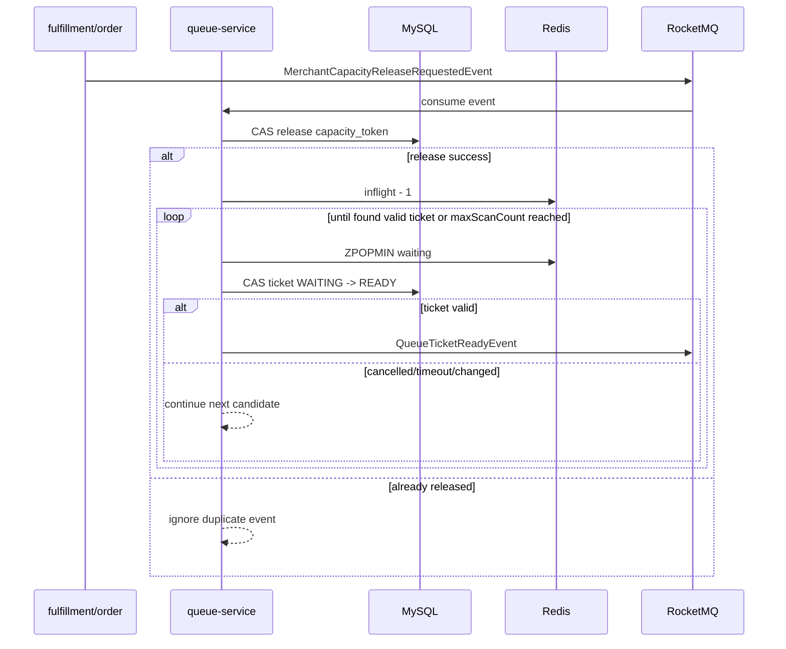

# MealFlow 高峰排队专题设计

## 1. 本文解决什么问题

本文只讨论高峰期下单排队。它要解决的不是“请求太多怎么异步处理”，而是：

- 用户下单时商户暂时没有履约能力，系统如何给出明确业务反馈。
- 排队状态如何查询、取消、超时、恢复。
- 商户产能释放后如何只放行一个或一批合适的用户。
- Redis、MySQL、RocketMQ 各自承担什么职责。

核心结论：

```text
QueueTicket 是业务排队事实。
capacity_token 是商户处理资格事实。
Redis 是热索引和快速计数。
RocketMQ 是事件通知通道。
```

RocketMQ 不保存“用户正在排队”这个事实。用户是否在排队，只能由 queue-service 的 `queue_ticket` 表决定。

## 2. 为什么这样设计

外卖高峰期的本质是商户履约能力有限。系统不是缺线程，也不是缺 MQ，而是不能让超出厨房能力的订单无限涌入商户。

如果把 RocketMQ 当成排队队列，会有几个根本问题：

- 用户无法稳定查询自己排第几。
- 用户取消时无法从 MQ 中精确删除消息。
- 会员优先、补偿优先、等待老化都不好做。
- 预计等待时间无法基于业务状态计算。
- MQ 消息被消费时，用户资格可能已经取消或过期。

因此：

- 排队状态由 `queue_ticket` 保存。
- 排队顺序由 Redis ZSet 加速。
- 处理资格由 `capacity_token` 保存。
- MQ 只负责通知“状态发生了变化，请相关服务处理”。

## 3. 核心对象

### 3.1 QueueTicket

`QueueTicket` 表示用户进入商户等待队列的业务凭证。

状态码数值以 `MealFlow-status-codes.md` 为准。

状态：

```text
WAITING        等待中，可取消
READY          已获得处理资格，可创建订单
PROCESSING     order-service 正在根据 ticket 创建订单
ORDER_CREATED  已创建正式订单
CANCELLED      用户取消
TIMEOUT        等待超时
FAILED         创建订单失败
```

状态机：



建议表结构：

```sql
CREATE TABLE queue_ticket (
  id BIGINT PRIMARY KEY,
  ticket_no VARCHAR(64) NOT NULL,
  user_id BIGINT NOT NULL,
  merchant_id BIGINT NOT NULL,
  cart_snapshot JSON NOT NULL,
  price_snapshot JSON NOT NULL,
  submit_snapshot JSON NOT NULL,
  status TINYINT NOT NULL,
  priority INT NOT NULL DEFAULT 0,
  queue_score BIGINT NOT NULL,
  ahead_count_snapshot INT NOT NULL DEFAULT 0,
  estimated_wait_seconds INT NOT NULL DEFAULT 0,
  order_id BIGINT DEFAULT NULL,
  ready_time DATETIME DEFAULT NULL,
  processing_time DATETIME DEFAULT NULL,
  retry_count INT NOT NULL DEFAULT 0,
  last_error VARCHAR(512) DEFAULT NULL,
  expire_time DATETIME NOT NULL,
  version INT NOT NULL DEFAULT 0,
  create_time DATETIME NOT NULL,
  update_time DATETIME NOT NULL,
  UNIQUE KEY uk_ticket_no(ticket_no),
  KEY idx_merchant_status_score(merchant_id, status, queue_score),
  KEY idx_status_ready_time(status, ready_time),
  KEY idx_status_processing_time(status, processing_time),
  KEY idx_user_create_time(user_id, create_time)
);
```

为什么保存快照：

- 用户排队期间购物车可能变化。
- 商品价格可能变化。
- 优惠券可能过期或被取消。
- 商户菜单可能下架。

排到时必须基于提交那一刻的快照创建订单，而不是重新读取当前购物车。

### 3.2 CapacityToken

`capacity_token` 表示商户释放给某个 ticket 或 order 的处理资格。它是防止 inflight 泄漏和重复释放的关键。

状态：

```text
HELD       正在占用商户产能
RELEASED   已正常释放
EXPIRED    超时释放
```

建议表结构：

```sql
CREATE TABLE capacity_token (
  id BIGINT PRIMARY KEY,
  request_id VARCHAR(128) DEFAULT NULL,
  merchant_id BIGINT NOT NULL,
  ticket_id BIGINT DEFAULT NULL,
  order_id BIGINT DEFAULT NULL,
  status TINYINT NOT NULL,
  expire_time DATETIME NOT NULL,
  release_reason VARCHAR(64) DEFAULT NULL,
  create_time DATETIME NOT NULL,
  update_time DATETIME NOT NULL,
  UNIQUE KEY uk_request_id(request_id),
  UNIQUE KEY uk_ticket_id(ticket_id),
  UNIQUE KEY uk_order_id(order_id),
  KEY idx_merchant_status(merchant_id, status),
  KEY idx_status_expire(status, expire_time)
);
```

Redis `capacity:merchant:{merchantId}:inflight` 只是快速派生计数。真正判断某个订单是否占用产能，要看 `capacity_token.status = HELD`。

直接下单场景下，`capacity_token` 生命周期为：

```text
创建处理资格：request_id = submitRequestId, ticket_id = NULL, order_id = NULL, status = HELD
订单创建成功：order-service 创建订单后回告 queue-service，回填 order_id = Y
产能释放：按 order_id 或 capacity_token_id 定位 token，CAS HELD -> RELEASED
```

排队转订单场景下，`capacity_token` 生命周期为：

```text
创建处理资格：request_id = submitRequestId, ticket_id = X, order_id = NULL, status = HELD
订单创建成功：queue-service 收到 OrderCreatedFromTicketEvent 后回填 order_id = Y
产能释放：按 order_id 或 capacity_token_id 定位 token，CAS HELD -> RELEASED
```

因此同一行 token 可以同时保留 `request_id`、`ticket_id` 和 `order_id`：`request_id` 用于直接下单孤儿 token 补偿和接口重试幂等，`ticket_id` 用于追溯排队来源，`order_id` 用于订单取消、支付超时、出餐完成等后续释放场景。`order-service` 不直接写 `capacity_token`，只能通过事件或 queue-service 内部接口回告订单创建结果。

释放产能必须先 CAS 更新 MySQL：

```sql
UPDATE capacity_token
SET status = 2,
    release_reason = ?,
    update_time = NOW()
WHERE id = ?
  AND status = 1;
```

只有这条 SQL 更新成功，才允许：

```text
Redis inflight - 1
触发下一个 QueueTicket READY
```

如果 SQL 更新 0 行，说明 token 已经释放过。此时不能再扣 Redis inflight，也不能再次放行下一个 ticket。

## 4. Redis 数据结构

```text
queue:merchant:{merchantId}:waiting
  ZSet，member=ticketNo，score=queueScore

queue:ticket:{ticketId}
  Hash，票据摘要，用于高频查询

capacity:merchant:{merchantId}:inflight
  String，当前 HELD token 派生计数

capacity:merchant:{merchantId}:limit
  String，当前动态产能上限

queue:merchant:{merchantId}:metrics
  Hash，排队人数、平均出餐时长、最近释放速率
```

Redis 故障恢复：

```text
扫描 queue_ticket where status = WAITING
-> 按 queue_score 重建 waiting ZSet
扫描 capacity_token where status = HELD
-> 按 merchant_id 重新统计 inflight
```

所以 Redis 可以丢，业务事实不能丢。

## 5. 排队分数和优先级

基础 score：

```text
queueScore = createTimeMillis - priorityWeightMillis
```

为了同分稳定：

```text
member = ticketNo
ticketNo 使用趋势递增 ID
```

优先级约束：

- `priorityWeightMillis` 最大只能提前 2 分钟。
- 普通用户等待超过 10 分钟自动加老化权重。
- 补偿用户优先级高于会员，但也必须设置上限。
- 后台人工调整必须写操作日志。

示例：

```text
普通用户 priorityWeightMillis = 0
会员用户 priorityWeightMillis = min(30_000, maxPriorityWeightMillis)
补偿用户 priorityWeightMillis = min(60_000, maxPriorityWeightMillis)
等待老化 agingWeightMillis = min(waitSeconds * 1000, agingMaxWeightMillis)

queueScore = createTimeMillis - priorityWeightMillis - agingWeightMillis
```

为什么加老化：

如果持续有高优先级用户进入，普通用户可能一直被插队。老化机制能保证长期等待用户逐渐被提升。

注意单位：`createTimeMillis` 是毫秒时间戳，所以 `priorityWeightMillis` 和 `agingWeightMillis` 也必须使用毫秒单位。若使用 `waitSeconds / 60 * 5_000` 这类分钟级小权重，在 13 位毫秒时间戳面前几乎没有实际效果。

## 6. 等待时间估算

### 6.1 校招实现版

```text
estimatedWaitSeconds = ceil(aheadCount / dynamicLimit) * avgPrepareSeconds
```

示例：

```text
aheadCount = 25
dynamicLimit = 5
avgPrepareSeconds = 180

estimatedWaitSeconds = ceil(25 / 5) * 180 = 900 秒
```

解释：

- `dynamicLimit` 表示商户可以同时制作的订单数。
- 每一批大约需要 `avgPrepareSeconds`。
- 前面 25 单、每批 5 单，需要 5 批。

### 6.2 真实指标版

```text
releaseRate = recentCompletedCount / recentWindowSeconds
estimatedWaitSeconds = aheadCount / max(releaseRate, minReleaseRate)
```

注意单位：

- `releaseRate` 是单/秒。
- `aheadCount / releaseRate` 已经是秒。
- 后面不能再乘 `avgPrepareSeconds`。

`minReleaseRate` 防止除零，但不能写成 `max(1, dynamicLimit / avgPrepareSeconds)`。如果商户 180 秒完成 5 单，释放速率是 0.027 单/秒，不是 1 单/秒。

## 7. 动态产能

merchant-service 拥有基础配置：

```text
baseCapacity
manualFactor
businessStatus
```

queue-service 计算动态产能：

```text
dynamicLimit = max(1, floor(
  baseCapacity
  * merchantHealthFactor
  * riderSupplyFactor
  * manualFactor
  * activityFactor
))
```

参数说明：

```text
baseCapacity          商户基础同时处理数
merchantHealthFactor  由待制作订单、P90 出餐时间、异常率计算
riderSupplyFactor     骑手供给系数
manualFactor          商户手动降载系数
activityFactor        活动高峰系数
```

示例：

```text
baseCapacity = 20
merchantHealthFactor = 0.7
riderSupplyFactor = 0.8
manualFactor = 0.5
activityFactor = 1.0

dynamicLimit = max(1, floor(20 * 0.7 * 0.8 * 0.5 * 1.0)) = 5
```

校招实现版 `merchantHealthFactor`：

```text
loadFactor = clamp(1 - max(0, pendingCookingCount - baseCapacity) / baseCapacity, 0.5, 1.0)
prepareFactor = clamp(targetPrepareSeconds / max(p90PrepareSeconds, targetPrepareSeconds), 0.6, 1.0)
exceptionFactor = clamp(1 - recentExceptionRate * 2, 0.7, 1.0)

merchantHealthFactor = min(loadFactor, prepareFactor, exceptionFactor)
```

示例：

```text
baseCapacity = 20
pendingCookingCount = 26
targetPrepareSeconds = 180
p90PrepareSeconds = 240
recentExceptionRate = 0.05

loadFactor = 1 - (26 - 20) / 20 = 0.7
prepareFactor = 180 / 240 = 0.75
exceptionFactor = 1 - 0.05 * 2 = 0.9

merchantHealthFactor = min(0.7, 0.75, 0.9) = 0.7
```

这个公式不追求绝对真实，但可测试、可解释、可压测调参。

## 8. 下单入口流程



开发注意：

- 有产能时也要创建 `capacity_token`，不能只加 Redis inflight。
- 创建订单失败时必须释放 token。
- 用户进入支付页但未支付，token 仍然占用厨房产能，直到支付超时、取消、拒单或出餐完成释放。

## 9. 产能释放流程

释放时机：

- 商户拒单。
- 用户取消。
- 支付超时。
- 出餐完成。
- 订单异常关闭。

不释放的时机：

- 商户接单。

原因：接单后厨房制作才刚开始，如果接单即释放，系统会继续放行订单，导致商户待制作订单越积越多。

流程：



`ZPOPMIN` 是不可逆操作，不能弹出一个无效 ticket 后直接结束。产能释放时必须使用循环候选逻辑：

```text
maxScanCount = 50
while scanned < maxScanCount:
  candidate = ZPOPMIN queue:merchant:{merchantId}:waiting
  if candidate is empty:
    break

  affected = UPDATE queue_ticket
             SET status = READY,
                 ready_time = NOW(),
                 version = version + 1
             WHERE ticket_no = candidate.member
               AND status = WAITING

  if affected == 1:
    publish QueueTicketReadyEvent
    break

  continue
```

这样可以处理“刚弹出 ticket，用户已取消/超时/状态变化”的并发场景。无效 ticket 被丢弃后继续弹下一个，避免本次产能释放被浪费。

## 10. READY/PROCESSING 补偿

常见故障：

```text
order-service 收到 QueueTicketReadyEvent
-> ticket READY -> PROCESSING
-> 还没创建订单，order-service 宕机
```

如果不补偿，ticket 会永远卡在 PROCESSING。

补偿任务：

```text
扫描 READY 超过 30 秒且 order_id 为空的 ticket
-> 重发 QueueTicketReadyEvent

扫描 PROCESSING 超过 60 秒且 order_id 为空的 ticket
-> 调 order-service 按 queue_ticket_id 查询订单
-> 如果订单存在，ticket -> ORDER_CREATED
-> 如果订单不存在且 retry_count < maxRetry，PROCESSING -> READY 并重发事件
-> 如果 retry_count 超限，PROCESSING -> FAILED，释放 capacity_token、库存和优惠券

扫描直接下单孤儿 capacity_token：
WHERE status = HELD
  AND ticket_id IS NULL
  AND order_id IS NULL
  AND create_time < NOW() - directTokenTimeout

-> 根据 request_id 查询 order-service/idempotent_request
-> 如果订单已创建，回填 capacity_token.order_id
-> 如果订单未创建且请求已超时，CAS 释放 capacity_token
-> 同步释放同 request_id 下的 stock_reservation 和 voucher_lock
```

READY 重发事件时，`eventKey` 保持 `queue:QueueTicketReady:{ticketId}:{version}` 不变。消费者如果已有 FAILED 记录，不应永久跳过，而应按 `consumer_record` 的 FAILED 重试规则重新抢占消费。这个规则定义在 `MealFlow-consistency-data-model.md`。

状态更新必须使用 CAS：

```sql
UPDATE queue_ticket
SET status = ?, version = version + 1
WHERE id = ?
  AND status = ?
  AND version = ?;
```

## 11. 取消语义

不同阶段取消含义不同。

| 阶段 | 含义 | 处理 |
| --- | --- | --- |
| WAITING | 取消排队 | ticket -> CANCELLED，Redis ZSet 移除，释放库存和券 |
| READY | 取消处理资格 | ticket -> CANCELLED，释放 capacity_token、库存和券 |
| PROCESSING | 取消处理中资格 | 先按 queue_ticket_id 查询订单；未创建则 queue-service 释放 capacity_token、库存和券；已创建则转订单取消 |
| PENDING_PAYMENT | 取消订单 | order -> CANCELLED，关闭支付单，释放资源 |

用户接口可以统一是“取消”，但后端必须按状态分派。

`capacity_token` 始终归 queue-service 管理，不会因为进入 PROCESSING 就转移所有权给 order-service。order-service 只拿到 `capacityTokenId` 用于创建订单和后续释放请求。若 PROCESSING 阶段订单未创建，queue-service 可以直接释放该 token；若订单已创建，则由订单取消流程发起 `MerchantCapacityReleaseRequestedEvent`。

## 12. QueueTicket 转订单

order-service 创建订单必须以 `queue_ticket_id` 做业务幂等。

订单表要求：

```sql
ALTER TABLE orders
ADD COLUMN queue_ticket_id BIGINT DEFAULT NULL,
ADD UNIQUE KEY uk_queue_ticket_id(queue_ticket_id);
```

创建逻辑：

```text
收到 QueueTicketReadyEvent
-> 根据 queue_ticket_id 查订单
-> 已存在则返回已有 orderId
-> 不存在则创建订单，写 queue_ticket_id
-> 写 OrderCreatedFromTicketEvent
-> queue-service 消费事件后 ticket -> ORDER_CREATED
```

不能只靠 `consumer_record.messageId`。Outbox 重发同一业务事件时，MQ messageId 可能变化。

## 13. 验收标准

高峰排队模块完成时，至少要能验证：

- 无产能时返回 ticket，而不是阻塞请求。
- ticket 可查询前方人数和预计等待时间。
- WAITING 可取消。
- READY 未创建订单时可补偿。
- PROCESSING 卡住可恢复或失败释放。
- 商户接单不释放产能，出餐完成才释放。
- capacity_token 重复释放不会让 inflight 多减。
- Redis 删除后可从 MySQL 重建等待队列和 inflight。
- QueueTicketReadyEvent 重复投递不会重复创建订单。
- 普通用户不会因优先级机制长期饥饿。
