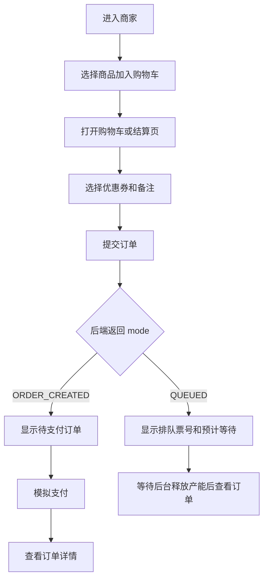

# MealFlow 用户端 H5 前端设计规范

## 目标

用户端 H5 面向普通点餐用户，优先覆盖真实点餐闭环，而不是接口测试入口。第一版使用 Vue3 + Vite 实现移动端 Web，作为后续小程序或 App 的交互原型和联调入口。

核心闭环：

1. 登录并建立用户身份。
2. 浏览商家列表和营业状态。
3. 进入商家，按类目浏览上架商品。
4. 加入购物车、调整数量、选择商品。
5. 领取优惠券并在结算时使用。
6. 提交订单，展示即时成单或排队结果。
7. 对待支付订单执行模拟支付。
8. 查看订单列表、订单详情和履约状态。
9. 查看通知消息。

## 应用结构

目录建议为 `meal-user-web`，与管理后台 `meal-web` 并列：

```text
meal-user-web/
  src/
    api/
    components/
    router/
    stores/
    styles/
    types/
    views/
```

路由：

| 路由 | 页面 | 说明 |
| --- | --- | --- |
| `/login` | 登录 | 手机号 + 验证码演示登录 |
| `/` | 首页 | 商家列表、入口摘要、未读通知提示 |
| `/merchant/:merchantId` | 点餐 | 商家头部、类目、SKU、购物车吸底栏 |
| `/cart` | 购物车 | 跨页购物车管理、选择项、清空 |
| `/checkout` | 结算 | 选中商品、券包、备注、提交订单 |
| `/order-result` | 下单结果 | 成单/排队状态、支付入口 |
| `/orders` | 订单列表 | 按状态快速查看历史订单 |
| `/orders/:orderId` | 订单详情 | 商品、金额、支付、履约状态 |
| `/vouchers` | 优惠券 | 可领取券、我的券包 |
| `/messages` | 通知 | 站内通知消息 |

底部导航保留四个一级入口：首页、订单、优惠券、我的。购物车和结算通过业务动作进入。

## 视觉原则

- 移动端宽度按 375px 到 430px 优先适配，桌面预览时居中显示手机宽度容器。
- 页面以真实外卖点餐为语境：商家状态、商品价格、库存、购物车数量、订单状态必须清晰。
- 不做大面积营销页，不堆叠“调用接口”卡片；每个页面对应自然用户任务。
- 底部关键操作固定展示：购物车合计、去结算、提交订单、模拟支付。
- 颜色使用白底、浅灰页面底、蓝色主操作、绿色成功、橙色排队/待支付、红色取消/错误。
- 不依赖真实商品图片时，使用稳定的文字占位和浅色块，避免破图。

## 状态与权限

登录使用 `/auth/login`，本地保存 token 和登录信息。用户端默认演示账号：

- 手机号：`13800000000`
- 验证码：任意

Axios 请求统一附带 `Authorization: Bearer <token>`。401 时清理登录态并跳转登录页。

## 后端接口映射

| 能力 | 接口 |
| --- | --- |
| 登录 | `POST /auth/login` |
| 用户资料 | `GET /users/me` |
| 商家列表 | `GET /merchants` |
| 商家详情 | `GET /merchants/{merchantId}` |
| 商品类目 | `GET /catalog/merchants/{merchantId}/categories` |
| 商品列表 | `GET /catalog/merchants/{merchantId}/skus` |
| 购物车列表 | `GET /cart` |
| 加入购物车 | `POST /cart/items` |
| 修改数量 | `PUT /cart/items/{cartItemId}` |
| 选择商品 | `PUT /cart/items/{cartItemId}/selected` |
| 删除购物车项 | `DELETE /cart/items/{cartItemId}` |
| 清空购物车 | `DELETE /cart` |
| 优惠券列表 | `GET /vouchers/admin` |
| 领取优惠券 | `POST /vouchers/{voucherId}/seckill` |
| 我的券包 | `GET /vouchers/wallet` |
| 提交订单 | `POST /orders/submit`，用户端将选中购物车项转换为 `items` 提交 |
| 订单列表 | `GET /orders` |
| 订单详情 | `GET /orders/{orderId}` |
| 取消订单 | `POST /orders/{orderId}/cancel` |
| 模拟支付 | `POST /payments/{payOrderId}/mock-pay` |
| 通知消息 | `GET /notify/messages` |

## 下单流程



## 第一版验收标准

- 能从首页进入商家并看到真实商品、价格、库存和上下架状态。
- 能加入购物车、调整数量、选中/取消选中、清空。
- 能领取优惠券并在结算页选择用户券。
- 能提交订单，并区分“直接成单”和“进入排队”。
- 能对待支付订单模拟支付并刷新状态。
- 能查看订单列表、订单详情、通知消息。
- 构建通过，README 说明本地运行方式和环境变量。
